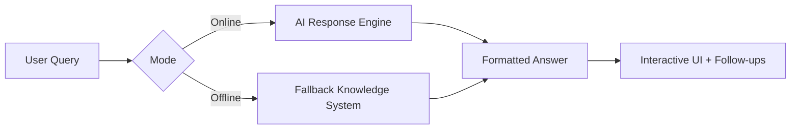
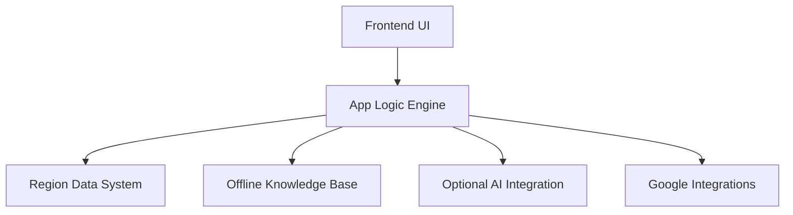

<p align="center">
  
</p>

<p align="center">
  
</p>

<p align="center">
  <b>AI-Powered Election Education Platform</b><br/>
  Understand • Learn • Participate
</p>

<p align="center">
  
  
  
</p>

<p align="center">
  <b>Understand Democracy. Navigate Elections. Make Informed Decisions.</b><br/>
  A modern, offline-first civic education assistant with intelligent guidance.
</p>

<p align="center">
  
  
  
  
</p>

---

## ✨ Overview

**CivicGuide** is a **high-performance, accessibility-first web application** that simplifies complex election processes into structured, understandable, and interactive guidance.

It combines:

* 🧠 Intelligent AI assistance
* 🌍 Multi-country election knowledge
* ⚡ Offline-first reliability
* 🎨 Premium UI design system

---

## 🧩 Core Capabilities



---

## 🎯 Feature Highlights

### 🧠 Intelligent Assistance Engine

* AI-powered responses (API optional)
* Smart keyword-based fallback system
* Structured answers with follow-up prompts 

---

### 🌍 Global Election Coverage

Supports multiple regions with localized data:

| Region     | Authority | Key Insight        |
| ---------- | --------- | ------------------ |
| 🇮🇳 India | ECI       | 970M+ voters       |
| 🇺🇸 USA   | Vote.gov  | Electoral College  |
| 🇬🇧 UK    | GOV.UK    | FPTP system        |
| 🌎 Global  | IFES      | Universal guidance |

Backed by structured region configs 

---

### 📊 Interactive Election Timeline

```text
1. Candidate Filing
2. Voter Registration
3. Campaign Period
4. Voter Education
5. Voting Day
6. Vote Counting
7. Certification
```

* Clickable steps
* Context-aware explanations
* Progress tracking UI

---

### 💬 Conversational Interface

* Clean chat UI with message bubbles
* Markdown → HTML renderer
* Built-in sanitization (XSS protection) 
* Follow-up suggestion engine

---

### ⚡ Offline-First Architecture

| Capability             | Status |
| ---------------------- | ------ |
| Works without internet | ✅      |
| Local fallback answers | ✅      |
| Session-based AI key   | ✅      |

Defined in core app logic 

---

### 🔎 Smart Integrations

* 📍 Google Maps → Polling locations
* 🔍 Search → Election info
* 📅 Calendar → Election reminders
* 🌐 Translate → Multi-language support

---

## 🎨 Design System

| Element         | Description                         |
| --------------- | ----------------------------------- |
| 🎨 Color Scheme | Dark civic blue + gold accents      |
| 🔤 Typography   | Cormorant (serif) + Outfit (modern) |
| 📱 Layout       | Responsive 3-panel system           |
| ♿ Accessibility | ARIA roles + keyboard nav           |

Powered by modular CSS architecture 

---

## 🏗️ Architecture



---

## 📁 Project Structure

```bash
civicguide/
│
├── index.html        # Application shell & UI :contentReference[oaicite:5]{index=5}
├── styles.css        # Design system :contentReference[oaicite:6]{index=6}
├── app.js            # Core application logic :contentReference[oaicite:7]{index=7}
├── Civicguidetest.js # Testing suite :contentReference[oaicite:8]{index=8}
└── package.json      # Metadata & scripts :contentReference[oaicite:9]{index=9}
```

---

## ⚙️ Setup & Usage

### 🚀 Run Locally

```bash
git clone https://github.com/your-username/civicguide.git
cd civicguide
open index.html
```

> No build tools required — runs directly in browser.

---

### 🔑 Enable AI Mode (Optional)

1. Get API key (Anthropic)
2. Launch app
3. Enter key in modal

✔ Stored securely in session only

---

## 🧪 Testing

```bash
node tests/civicguide.test.js
```

### Coverage Includes:

* Input sanitization
* Markdown parsing
* Offline logic
* Region data integrity
* Security (XSS prevention) 

---

## 🔐 Security Considerations

* HTML escaping for all user inputs
* No persistent storage of API keys
* Controlled rendering pipeline
* Defensive UI architecture

---

## 🚀 Roadmap

* 📱 Progressive Web App (PWA)
* 🔊 Voice-based interaction
* 🌐 Real-time election APIs
* 📊 Data visualization dashboards
* 📍 Geo-personalized voting info

---

## 🤝 Contributing

Contributions are welcome.
For major changes:

1. Open an issue
2. Discuss proposal
3. Submit PR

---

## 📜 License

MIT License

---

## 💡 Final Thought

> CivicGuide bridges the gap between **complex election systems** and **everyday citizens** —
> making democracy more **accessible, transparent, and understandable**.


